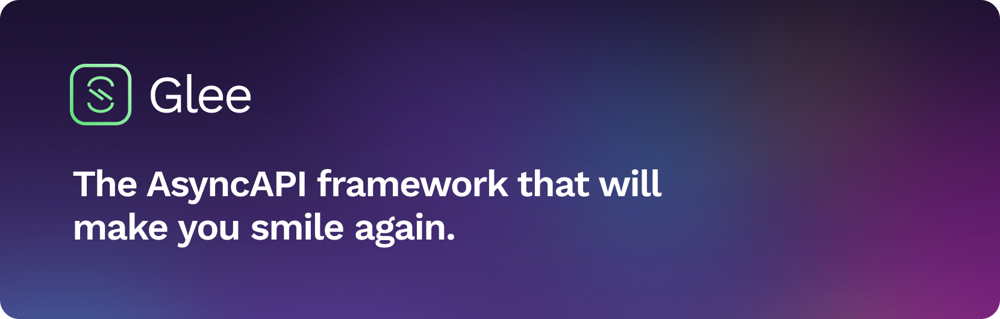

<!-- ALL-CONTRIBUTORS-BADGE:START - Do not remove or modify this section -->

[](#contributors-)

<!-- ALL-CONTRIBUTORS-BADGE:END -->

[](https://coveralls.io/github/asyncapi/glee?branch=master)

> :warning: Glee is still under development, it didn't reach v1.0.0 and therefore is not suitable for production use yet.

> :warning: So far, it only supports MQTT and WebSockets (native, Socket.IO, and custom implementations).

## What's Glee?

Glee is a spec-first framework that helps you build server-side applications. It leverages the AsyncAPI specification to make you more productive:

- It makes sure your code and AsyncAPI definition are on par. No more outdated documentation. Glee takes care of it for you, automatically.
- Glee lets you focus on what matters and handles the rest for you. You only write the code for your business use-case. Glee takes care of performance, scalability, resilience, and everything you need to make your application production-ready.

## Setup

The best way to get started with Glee is using `create-glee-app`, which sets up everything automatically for you. To create a project, run:

```bash
npx create-glee-app
```

After the installation is complete, follow the instructions to start the development server.

For more information on how to use `create-glee-app`, you can review [the `create-glee-app` documentation](https://github.com/asyncapi/create-glee-app).

## Getting started

- :file_folder: [Application structure](docs/app-structure.md): know how to structure your application with Glee.
- :gear: [Configuring your application](docs/config-file.md): tweak Glee's default configuration.
- :rocket: [Examples](./examples): see Glee in action.

## Generating documentation

When using spec-driven framework like Glee, it's always neccessary to have docs and code always in sync.
Glee will automatically generate documentation for your application and you can also generate your documentation yourself by running:

```bash
glee docs
```

You can also tweak Glee's default configuration for generating documentation here [Configuring your application](docs/config-file.md)

## Contributors ✨

Thanks goes to these wonderful people ([emoji key](https://allcontributors.org/docs/en/emoji-key)):

<!-- ALL-CONTRIBUTORS-LIST:START - Do not remove or modify this section -->
<!-- prettier-ignore-start -->
<!-- markdownlint-disable -->
<table>
  <tr>
    <td align="center"><a href="https://github.com/sudoshreyansh"><br /><sub><b>sudoshreyansh</b></sub></a><br /><a href="https://github.com/asyncapi/glee/commits?author=sudoshreyansh" title="Tests">⚠️</a></td>
  </tr>
</table>

<!-- markdownlint-restore -->
<!-- prettier-ignore-end -->

<!-- ALL-CONTRIBUTORS-LIST:END -->

This project follows the [all-contributors](https://github.com/all-contributors/all-contributors) specification. Contributions of any kind welcome!
