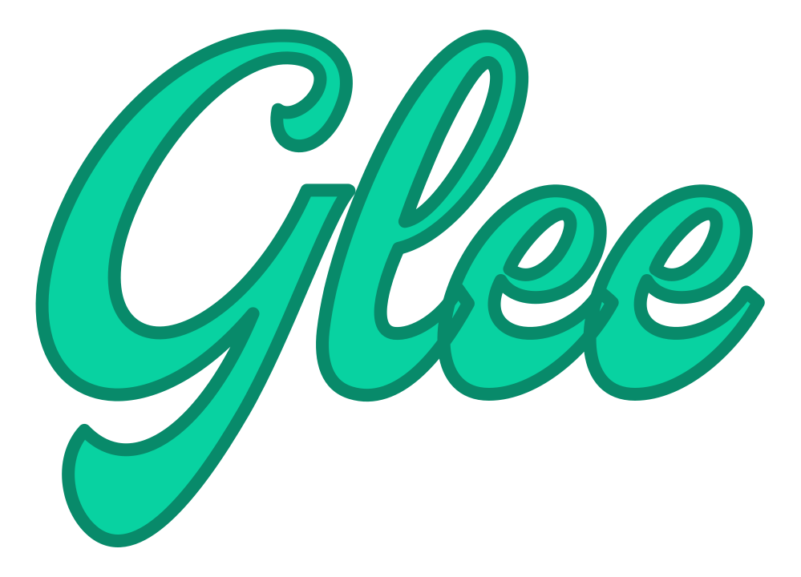

<h5 align="center">
  <br>
  
</h5>
<p align="center">
  <em>The AsyncAPI framework that will make you smile again.</em>
</p>


> :warning: This package is still under development, it didn't reach v1.0.0 yet, and therefore is not suitable for production use yet.

## Setup

The best way to get started with Glee is using `create-glee-app`, which sets up everything automatically for you. To create a project, run:

```bash
npx create-glee-app
```

After the installation is complete, follow the instructions to start the development server.

For more information on how to use `create-glee-app`, you can review [the `create-glee-app` documentation](https://github.com/asyncapi/create-glee-app).

## Examples

Have a look at the [examples](./examples) folder of this repository to get a better grasp on how to use it.

> :warning: So far, it just support MQTT and WebSockets (native, Socket.IO, and custom implementations).