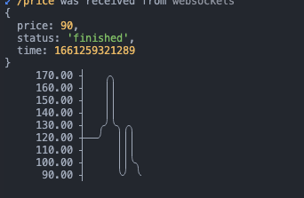

## Crypto Websockets 
This example tries to showcase how Glee could be used as a WebSocket client. There is a server that streams the price change of a fake cryptocurrency (we can call it asyncapicoin) and the client subscribes to this stream and draws a graph in the terminal. 

